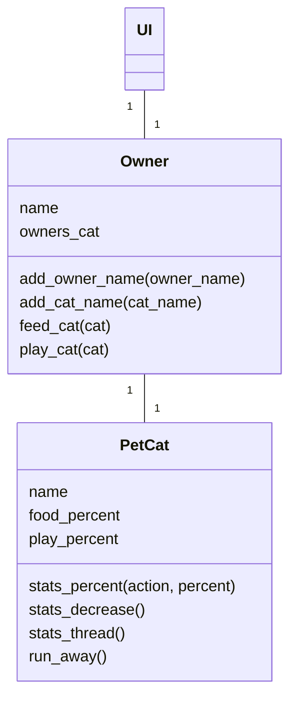

```mermaid
 classDiagram
      Owner "1" -- "1" PetCat
      UI "1" -- "1" Owner
      
      class Owner{
          name
          owners_cat
          add_owner_name(owner_name)
          add_cat_name(cat_name)
          feed_cat(cat)
          play_cat(cat)
      }
      class PetCat{
          name
          food_percent
          play_percent
          stats_percent(action, percent)
          stats_decrease()
          stats_thread()
          run_away()
      }
      class UI{
      }
```
