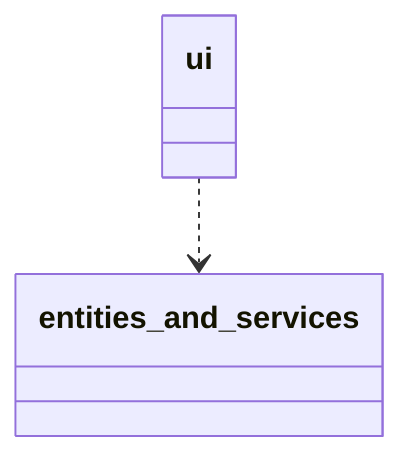
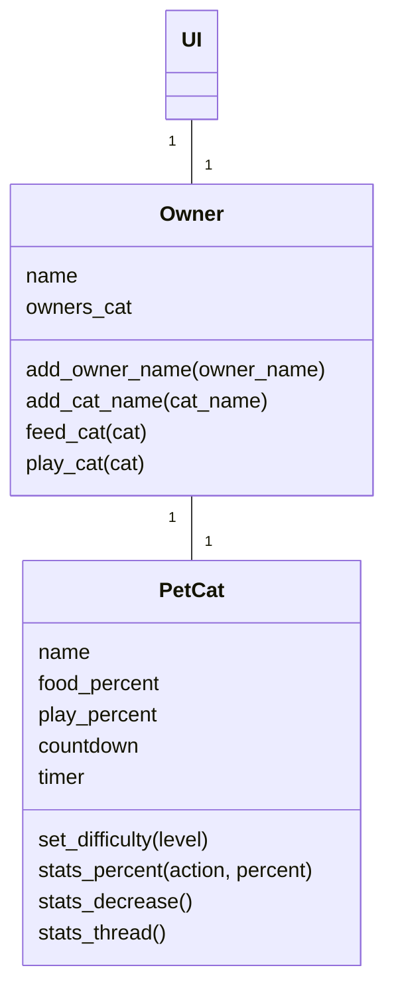
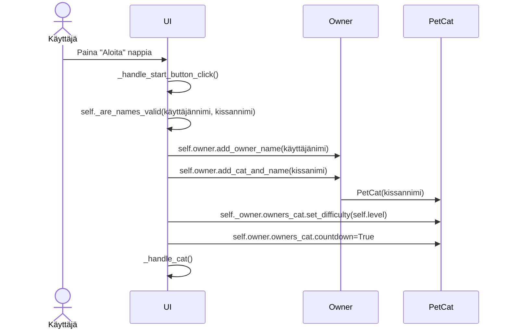
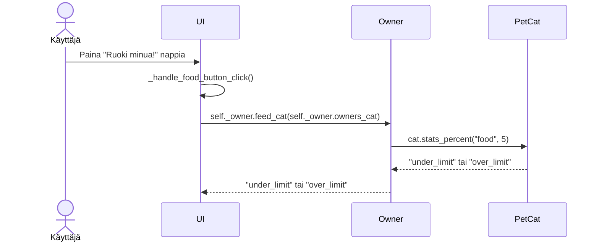
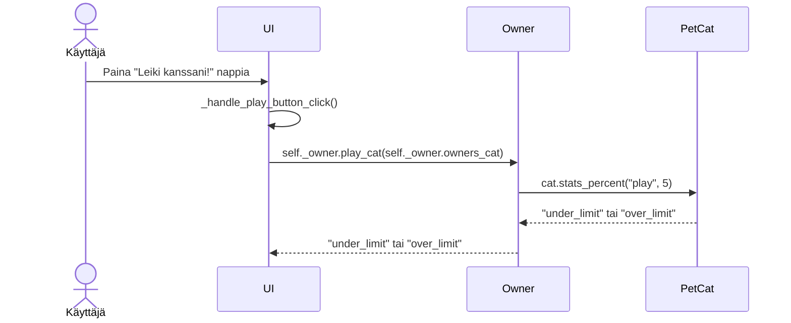

# Arkkitehtuurikuvaus

## Rakenne

Ohjelman tärkeiden kansioiden pakkausrakenne on seuraava:

Kansio ui sisältää käyttöliittymään liittyviä tiedostoja, ja kansio entities_and_services sisältää sovelluslogiikkaan ja luokkiin liittyviä tiedostoja. Käyttöliittymästä kutsutaan entities_and_services luokan metodeja sovelluslogiikkaan liittyvissä toiminnoissa. 

### Käyttöliittymä

Käyttöliittymä koostuu kolmesta näkymästä: aloitusnäkymä, ohjeet-näkymä ja kissa-näkymä. Käyttöliittymä on toteutettu tkinter:lla. Joka näkymälle on oma luokkansa, ja käyttöliittymä on pyritty eristämään sovelluslogiikasta mahdollisimman hyvin.

### Sovelluslogiikka

Sovelluksen sovelluslogiikan muodostaa luokat Owner sekä PetCat. Ohjelman luokkakaavio on seuraava:

Luokka PetCat sisältää metodeja liittyen kissan toimintaan, Owner luokka taas käyttäjään liittyvää toimintaa sekä toimintoja, mitä käyttäjä voi tehdä kissalle. Luokkakaaviossa näkyy myös luokkien metodit. PetCat luokkaa käsitellään vain Owner luokan kautta. 

### Tietojen pysyväistallennus

Sovelluksessa ei ole tällä hetkellä toteutettu tietojen pysyväistallennusta. Tämä toteutetaan mahdollisesti tulevaisuudessa. Ohjelman suoritusaikainen tallennus tapahtuu Owner sekä PetCat-olioissa. Tieto säilyy niissä niin kauan, kuin käyttäjä pitää Cat-näkymää auki. 

### Päätoiminnallisuudet

Ohjelman päätoiminnallisuudet ovat käyttäjän ja kissan luominen sekä kissan syöttäminen ja leikittäminen.
Alle on kuvastettu muutamat sekvenssikaavioina. 

#### Käyttäjän ja kissan luominen:

Painikkeen painaminen tarkistaa ensin UI-luokan sisäisellä metodilla, onko nimet ja vaikeustaso valittu. Jos nimet ovat kunnossa aktivoituu metodi joka yhdistää nimitiedot owner olioon. Kissa-olio luodaan Owner-luokassa, ja kissa yhdistetään samalla käyttäjään. Asetetaan vaikeustaso, joka määräytyy sen mukaan mitä nappia käyttäjä on painanut. Countdown arvo laitetaan päälle jotta kissan tarve-prosentit voivat seuraavassa näkymässä toimia oikein. Käyttöjärjestelmä kutsuu omaa metodiaan joka siirtää käyttäjän seuraavaan Cat-näkymään.

#### Kissan ruokkiminen

Painikkeen painaminen johtaa metodiin, joka kutsuu Owner luokan feed_cat metodia. Kyseisessä metodissa annetaan parametrit kissan prosenttien päivittämiselle, ja kutsutaan PetCat luokan metodia stats_percent. Siellä tarkistetaan, jos prosentit ovat jo yli 100 tai alle 0. Jos ovat, metodi palauttaa "under_limit" tai "over_limit". Muuten se korottaa PetCat olion food_percent muuttujaa. Palautusarvo välitetään käyttöliittymään, missä päivitetään tarpeen mukaan kommentti liiallisesta ruokamäärästä tai karannut-viesti. Jos paluuarvo ei ole kumpikaan, päivitetään kommentti hyvästä ruuasta.

#### Kissan leikittäminen

Toimii samalla lailla kuin yllä oleva kissan ruokkiminen.

#### Muut sovelluksen toiminnallisuudet 
Ne toteutuvat myös nappia painamalla, jolloin tapahtumakäsittelijä kutsuu siihen sopivaa metodia joka joko päivittää tai muuttaa arvoja, tai siirtyy näkymästä toiseen. Taustalla tapahtuvat toiminnallisuudet kuin kissan prosenttien vähenemien ja kuvien muuttuminen lähtevät käyntiin Cat-näkymään siirtyessä ja päivittyvät taustalla sovelluslogiikan metodien ehtojen mukaan.

### Ohjelman rakenteeseen jääneet heikkoudet

PetCat ja Owner luokat olisi voitu refaktoroida paremmin service ja entities rakenteen mukaisesti. Tiedontalletus puuttuu.
