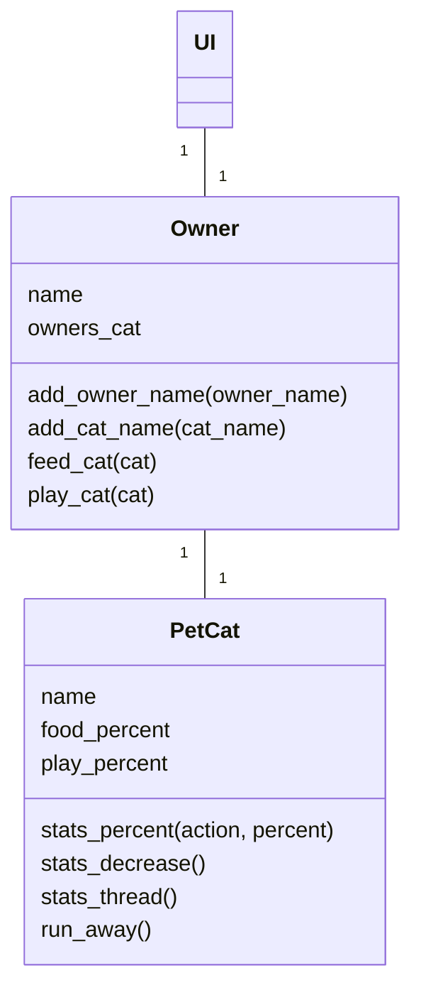
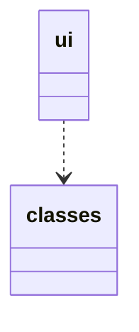

### Luokkakaavio

Luokka PetCat sisältää metodeja liittyen kissan toimintaan, Owner luokka taas käyttäjään liittyvää toimintaa sekä toimintoja, mitä käyttäjä voi tehdä kissalle. PetCat luokkaa käsitellään vain Owner luokan kautta. 

### Pakkauskaavio

Kansio ui sisältää käyttöliittymään liittyviä tiedostoja, ja kansio classes sisältää sovelluslogiikkaan liittyviä tiedostoja.

