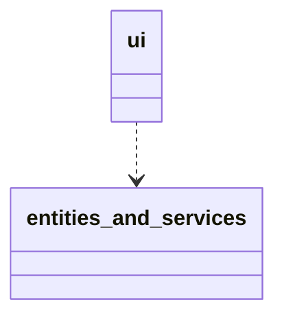
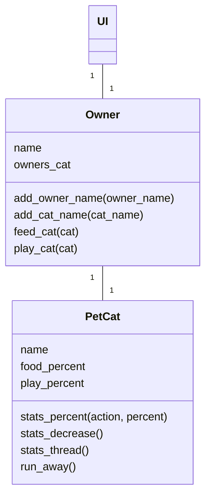
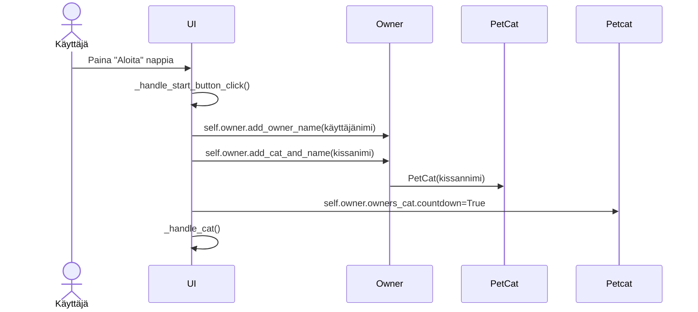

# Arkkitehtuurikuvaus

## Rakenne

Ohjelman tärkeiden kansioiden pakkausrakenne on seuraava:

Kansio ui sisältää käyttöliittymään liittyviä tiedostoja, ja kansio entities_and_services sisältää sovelluslogiikkaan ja luokkiin liittyviä tiedostoja. Käyttöliittymästä kutsutaan entities_and_services luokan metodeja sovelluslogiikkaan liittyvissä toiminnoissa. 

### Sovelluslogiikka

Sovelluksen sovelluslogiikan muodostaa luokat Owner sekä PetCat. Ohjelman luokkakaavio on seuraava:

Luokka PetCat sisältää metodeja liittyen kissan toimintaan, Owner luokka taas käyttäjään liittyvää toimintaa sekä toimintoja, mitä käyttäjä voi tehdä kissalle. Luokkakaaviossa näkyy myös luokkien metodit. PetCat luokkaa käsitellään vain Owner luokan kautta. 

/Kommentti: Jos aikaa riittää, eriytetään mahdollisesti PetCat ja Owner metodeja järkevämmin eri luokkiin entities ja services rakenteen mukaisesti.

### Tietojen pysyväistallennus

Sovelluksessa ei ole tällä hetkellä toteutettu tietojen pysyväistallennusta. Tämä toteutetaan, jos aika riittää. Ohjelman suoritusaikainen tallennus tapahtuu Owner sekä PetCat-olioissa. Tieto säilyy niissä niin kauan, kuin käyttäjä pitää Cat-näkymää auki. 

### Päätoiminnallisuudet

Ohjelman päätoiminnallisuudet ovat käyttäjän ja kissan luominen sekä kissan syöttäminen ja leikittäminen.
Alle on kuvastettu yhtä sekvenssikaavioina. 

Kun käyttäjän ja kissan nimet kirjoitetaan syötekenttiin ja painetaan aloita-painiketta, etenee sovellus seuraavasti:

Painikkeen painaminen aktivoi metodin joka hakee syötekenttien arvot, luo owner olion ja lisää käyttäjän nimen olioon. Kissa-olio luodaan Owner-luokassa, ja kissa yhdistetään samalla käyttäjään. Countdown arvo laitetaan päälle jotta kissan tarve-prosentit voivat seuraavassa näkymässä toimia oikein. Käyttöjärjestelmä kutsuu omaa metodiaan joka siirtää käyttäjän seuraavaan Cat-näkymään.

Muut sovelluksen toiminnallisuudet toteutuvat myös nappia painamalla, jolloin tapahtumakäsittelijä kutsuu siihen sopivaa metodia joka joko päivittää tai muuttaa arvoja, tai siirtyy näkymästä toiseen. Taustalla tapahtuvat toiminnallisuudet kuin kissan prosenttien vähenemien ja kuvien muuttuminen lähtevät käyntiin Cat-näkymään siirtyessä ja päivittyvät taustalla sovelluslogiikan metodien ehtojen mukaan.

