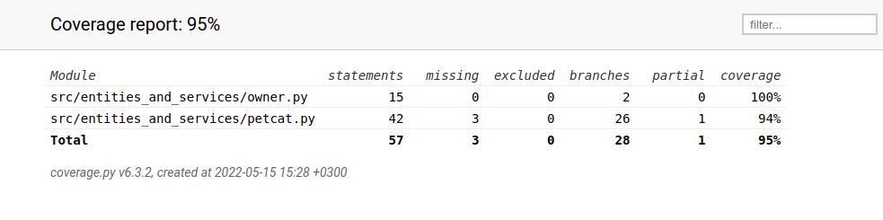

# Testausdokumentti
Tätä sovellusta on testattu sekä manuaalisesti järjestelmätason testeillä että automatisoiduilla yksikkö- ja integraatiotesteillä.

## Yksikkö- ja integraatiotestaus

### Sovelluslogiikka
Sovelluslogiikasta vastaavia luokkia on kaksi: `Owner` ja `PetCat`. Näille on luotu omat testiluokat: `TestOwner` ja `TestPetCat`. Alustuksissa molemmille luodaan luokkiensa omat oliot. 

### Testauskattavuus
Testauksen haarautumakattavuus on 95%.

Käyttöliittymä on jätetty testikattavuuden ulkopuolelle. Thread:iä ei erikseen saatu testattua. 

## Järjestelmätestaus
Järjestelmätestausta on suoritettu manuaalisesti. 

### Asennus
Sovellusta on testattu käyttöohjeen mukaisesti Linux-ympäristössä. 

### Toiminnallisuudet
Määrittelydokumentissa ja käyttöohjeessa olevia toiminnallisuuksia on testattu ja todettu toimiviksi. Tutkivaa testausta on suoritettu aktiivisesti koko sovelluksen luontivaiheen aikana. Tähän liittyen on seurattu tyypillisiä suunniteltuja kulkuja, sekä tilanteita, missä käyttäjä tekee jotain odottamatonta. Odottamattomat tilanteet ovat mm. tyhjien nimien syöttäminen, sekä yritykset ruokkia tai leikittää kissaa liikaa. 

## Sovellukseen jääneet laatuongelmat 
- Thread-toiminnossa piilee pieni vaara mahdolliselle race conditionille tilanteessa, missä sekä threadin toiminnallisuus yrittää päivittää arvoja samaan aikaan pääohjelman silmukan kanssa. Tällaista tilannetta ei olla saatu simuloitua, ja tämän virhetilan tapahtuminen on erittäin epätodennäköistä. 
- Käyttäjälle on jätetty mahdollisuus syöttää erikoismerkkejä tai numeroita käyttäjä- tai kissan nimeksi. 
- Sovelluksessa ei ole pysyväistallennusta ajanpuutteen vuoksi. 
- Threadin sleep toiminnon vuoksi ohjelma ei pääty tarkalleen kun sovelluksesta poistutaan, vaan vasta kun sleep ajastin on kulunut loppuun ja tarkistaa ehdon. Tämä näkyy helpossa ja keskivaikeassa vaikeustasoissa. Koska kyse on vain muutamista sekunteista en koe että se vaikuttaa liikaa ohjelman toimintaan.
