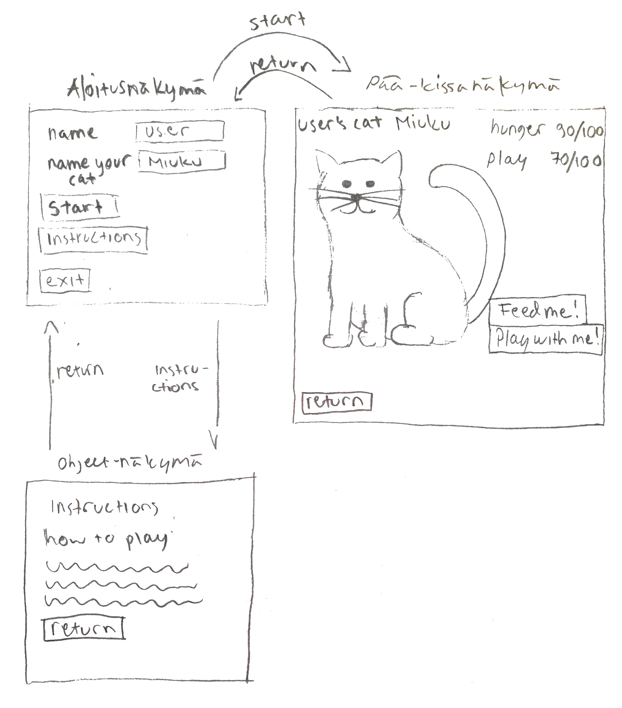

# Vaatimusmäärittely

## Sovelluksen tarkoitus

Sovelluksen avulla käyttäjä voi luoda virtuaalisen kissan lemmikikseen ja pitää siitä huolta. Käyttäjä pääsee kokemaan minkälaista vastuuta lemmikin omistaminen vaati. Jos käyttäjä ei vastaa kissan tarpeisiin, kissasta tulee tyytymätön omistajaansa ja karkaa.

## Perusversion tarjoama toiminnallisuus

- Käyttäjän nimi luodaan /tehty gui
- Käyttäjä valitsee kissalle nimen /tehty gui

- Käyttäjä näkee: 
	- kissan /tehty gui
	- miten nälkäinen kissa on /tehty gui
	- jos kissa tarvitsee leikittämistä /tehty gui

- Käyttäjä voi:
	- ruokkia kissaa /tehty gui
	- leikittää kissaa /tehty gui
	- poistua sovelluksesta /tehty gui
- Jos käyttäjä ei syötä tai leiki kissan kanssa tietyn aikaikkunan sisällä, kissa karkaa. /tehty gui osittain

## Jatkokehitysideoita

Kun tekstikäyttöliittymä on saatu toimimaan päivitetään se graafiseksi käyttöliittymäksi, joka voi sisältää esimerkiksi seuraavia elementtejä riippuen miten aikaa riittää:

- Alkusivu, missä on kentät oman nimen ja kissan nimen täyttämiselle, sekä painike mistä pääsee siirtymään kissa-näkymään. /tehty

- Ohjeet-painike, missä pääsee lukemaan ohjeet sovelluksen käyttöä varten. /tehty(teksti tekemättä)

Kissa-näkymä: /tehty

- Kissa: 
	- Kissan ilme muuttuu sen mukaan, miten täynnä tarpeet-palkit ovat. /kuvat luotu, näiden päivittäminen gui ei saatu vielä toimimaan.
	- Kissan keho kapeutuu kun nälkä-palkki on lähes tyhjä
	- Kissan keho suurentuu kun nälkä-palkki on täynnä ja syöttäminen jatkuu
	- Kissa sanoo asioita, esimerkiksi varoittaa ennen kun palkit ovat tyhjät, ja ilmaisee onnellisuutta kun ovat täynnä. /tehty
	
- Palkit tai prosentit, missä näkyy ruoka- ja leikki-tarpeet (esim. nälkä: 50/100)./tehty
- Taustakuva
- Poistu-painike /tehty

Jos aikaa riittää täydennetään ohjelmaa esim. seuraavin toiminnallisuuksin:
- lisätään muita tarpeita kissalle, kuten: nukkuminen, käynti hiekkalaatikolla, ulkoiluttaminen.
- Tiedon tallennus tiedostoon tai tietokantaan, jolloin käyttäjän nimellä voi seuraavan kerran avata saman kissan
- Käyttäjä saa valita kissan värin

## Käyttöliittymäluonnos

Kolme näkymää: aloitusnäkymä, info-näkymä ja itse kissa-näkymä. Siirtymiset näkymien välillä nuolten mukaisesti.

