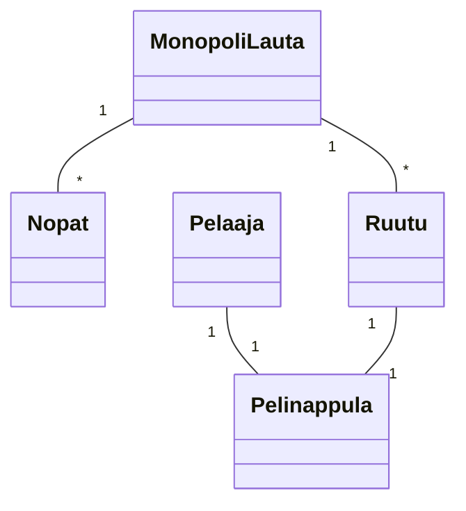
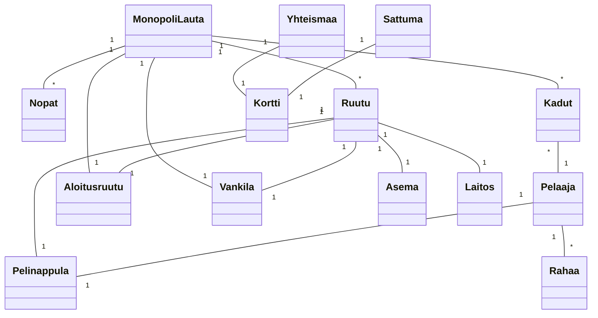

Tehtävä 1

Tehtävä 2

/* Huom, monopolipelin säännöt eivät olleet entuudestaan tuttuja. Menin materiaalin mukaan sillä oletuksella, ettei yksittäisiä funktioita tai parametreja täydy alustaa tai mainita luokkakaaviossa.
